## arquitectura_general.md

### Arquitectura General del Robot Asistente

**Objetivo:** Detallar la estructura y funcionamiento del software que controla un robot asistente físico capaz de interactuar con usuarios, moverse en un entorno y realizar tareas de reconocimiento de voz y de entorno.

### Descripción General

La arquitectura del robot se basa en una estructura modular, lo que facilita el desarrollo, mantenimiento y escalabilidad del sistema. Cada módulo se encarga de una tarea específica y se comunica con los demás a través de una interfaz bien definida.

### Diagrama UML de Clases

```mermaid
classDiagram
  class Robot {
    - interfazUsuario: InterfazUsuario
    - procesamientoLenguajeNatural: ProcesamientoLenguajeNatural
    - reconocimientoVoz: ReconocimientoVoz
    - navegacion: Navegacion
    - percepcion: Percepcion
    - controlMovimiento: ControlMovimiento
    - baseDatos: BaseDatos
  }

  class InterfazUsuario {
    + mostrarMensaje(mensaje: String)
    + recibirComando()
  }

  class ProcesamientoLenguajeNatural {
    + interpretarComando(comando: String)
  }

  class ReconocimientoVoz {
    + convertirAudioATexto(audio: Audio)
  }

  class Navegacion {
    + planificarRuta(origen: Punto, destino: Punto)
    + ejecutarRuta()
  }

  class Percepcion {
    + generarMapa()
    + detectarObjetos()
  }

  class ControlMovimiento {
    + mover(direccion: Direccion, distancia: Numero)
  }

  class BaseDatos {
    + guardarInformacion(informacion: Any)
    + recuperarInformacion(clave: String)
  }

```

  ### Relación entre Módulos

* **Módulo de Interfaz de Usuario:**
  * Proporciona una interfaz intuitiva para el usuario (pantalla táctil, comandos de voz).
  * Recibe comandos del usuario y los envía al módulo de procesamiento del lenguaje natural.
* **Módulo de Procesamiento del Lenguaje Natural:**
  * Interpreta los comandos de voz y las preguntas del usuario.
  * Identifica la intención del usuario y los argumentos relevantes.
  * Genera una representación semántica del comando.
* **Módulo de Reconocimiento de Voz:**
  * Convierte la señal de audio en texto utilizando técnicas de reconocimiento de voz.
  * Puede utilizar modelos preentrenados o personalizados para mejorar la precisión.
* **Módulo de Navegación:**
  * Planifica rutas óptimas utilizando algoritmos de búsqueda (A*, Dijkstra).
  * Realiza la localización del robot en el entorno.
  * Controla el movimiento del robot evitando obstáculos.
* **Módulo de Percepción:**
  * Utiliza sensores (cámaras, lidar) para obtener información del entorno.
  * Genera mapas del entorno.
  * Detecta objetos y personas.
* **Módulo de Control de Movimiento:**
  * Envía señales a los actuadores del robot (motores) para ejecutar los movimientos.
  * Utiliza controladores PID o controladores más avanzados para garantizar un movimiento preciso.
* **Módulo de Base de Datos:**
  * Almacena información sobre el estado del robot, el mapa del entorno, las preferencias del usuario y los históricos de interacción.
  * Permite la personalización del comportamiento del robot.

  ### Consideraciones Adicionales

* **Middleware:** Un middleware como ROS puede facilitar la comunicación entre los diferentes módulos, especialmente en sistemas robóticos complejos.
* **Escalabilidad:** La arquitectura debe ser diseñada para adaptarse a nuevas funcionalidades y a un mayor número de sensores y actuadores.
* **Robustez:** Se deben implementar mecanismos de tolerancia a fallos para garantizar la continuidad del servicio.
* **Seguridad:** Es fundamental proteger la privacidad del usuario y la seguridad del sistema.