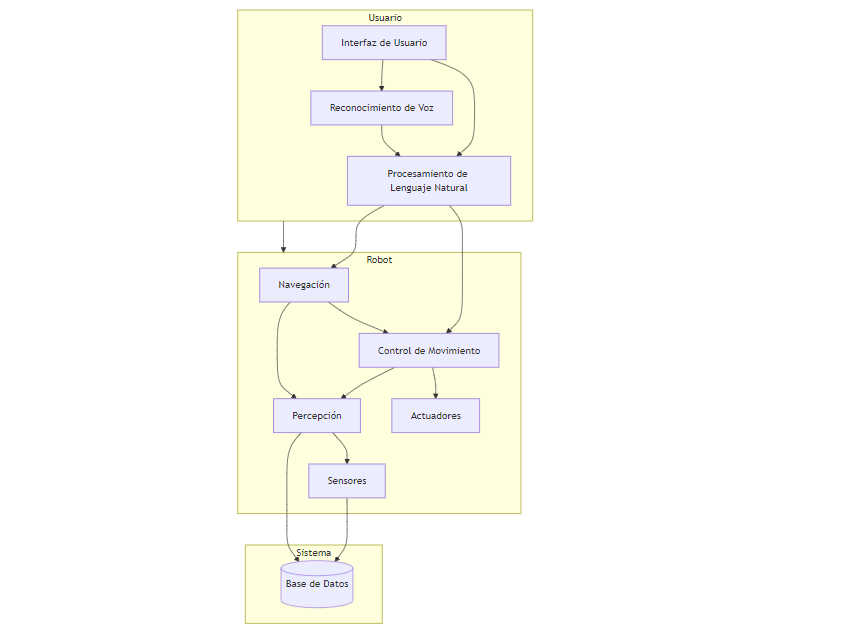

# Arquitectura General 🤖

**Objetivo:**  
Detallar la estructura y funcionamiento del software que controla un robot asistente físico capaz de interactuar con usuarios, moverse en un entorno y realizar tareas de reconocimiento de voz y de entorno.

### Descripción General 📋

La arquitectura del robot se basa en una estructura modular, lo que facilita el desarrollo, mantenimiento y escalabilidad del sistema. Cada módulo se encarga de una tarea específica y se comunica con los demás a través de una interfaz bien definida.

### Diagrama UML de Clases 🛠️

**Arquitectura:**

```mermaid
classDiagram
  class Robot {
    - interfazUsuario: InterfazUsuario
    - procesamientoLenguajeNatural: ProcesamientoLenguajeNatural
    - reconocimientoVoz: ReconocimientoVoz
    - navegacion: Navegacion
    - percepcion: Percepcion
    - controlMovimiento: ControlMovimiento
    - baseDatos: BaseDatos
  }

  class InterfazUsuario {
    + mostrarMensaje(mensaje: String)
    + recibirComando()
  }

  class ProcesamientoLenguajeNatural {
    + interpretarComando(comando: String)
  }

  class ReconocimientoVoz {
    + convertirAudioATexto(audio: Audio)
  }

  class Navegacion {
    + planificarRuta(origen: Punto, destino: Punto)
    + ejecutarRuta()
  }

  class Percepcion {
    + generarMapa()
    + detectarObjetos()
  }

  class ControlMovimiento {
    + mover(direccion: Direccion, distancia: Numero)
  }

  class BaseDatos {
    + guardarInformacion(informacion: Any)
    + recuperarInformacion(clave: String)
  }

```

 ### Relación entre Módulos 🔄

- **Módulo de Interfaz de Usuario 🖥️:**
  - Proporciona una interfaz intuitiva para el usuario (pantalla táctil, comandos de voz).
  - Recibe comandos del usuario y los envía al módulo de procesamiento del lenguaje natural.
  
- **Módulo de Procesamiento del Lenguaje Natural 🧠:**
  - Interpreta los comandos de voz y las preguntas del usuario.
  - Identifica la intención del usuario y los argumentos relevantes.
  - Genera una representación semántica del comando.
  
- **Módulo de Reconocimiento de Voz 🎤:**
  - Convierte la señal de audio en texto utilizando técnicas de reconocimiento de voz.
  - Puede utilizar modelos preentrenados o personalizados para mejorar la precisión.
  
- **Módulo de Navegación 🧭:**
  - Planifica rutas óptimas utilizando algoritmos de búsqueda (A*, Dijkstra).
  - Realiza la localización del robot en el entorno.
  - Controla el movimiento del robot evitando obstáculos.
  
- **Módulo de Percepción 👁️:**
  - Utiliza sensores (cámaras, lidar) para obtener información del entorno.
  - Genera mapas del entorno.
  - Detecta objetos y personas.
  
- **Módulo de Control de Movimiento 🚶:**
  - Envía señales a los actuadores del robot (motores) para ejecutar los movimientos.
  - Utiliza controladores PID o controladores más avanzados para garantizar un movimiento preciso.
  
- **Módulo de Base de Datos 💾:**
  - Almacena información sobre el estado del robot, el mapa del entorno, las preferencias del usuario y los históricos de interacción.
  - Permite la personalización del comportamiento del robot.

### Consideraciones Adicionales ⚙️

- **Middleware:**  
  Un middleware como ROS puede facilitar la comunicación entre los diferentes módulos, especialmente en sistemas robóticos complejos.
  
- **Escalabilidad:**  
  La arquitectura debe ser diseñada para adaptarse a nuevas funcionalidades y a un mayor número de sensores y actuadores.
  
- **Robustez:**  
  Se deben implementar mecanismos de tolerancia a fallos para garantizar la continuidad del servicio.
  
- **Seguridad:**  
  Es fundamental proteger la privacidad del usuario y la seguridad del sistema.

### Diagramas 🖼️

- **Diagrama de componentes del sistema:**  

- **Detalle de los sensores y actuadores:**  
  