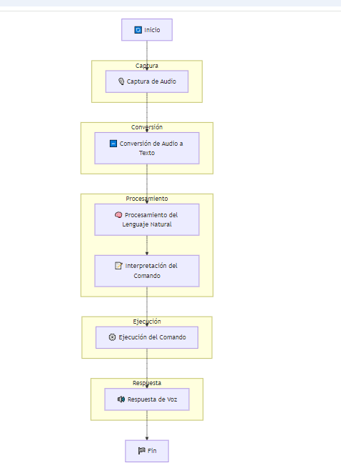

# Módulo de Control de Voz 🎤🤖

## Objetivo 🎯

- Permitir la interacción natural y eficiente entre los usuarios y el robot asistente mediante comandos de voz.
- Garantizar la precisión y la rapidez en la interpretación y ejecución de comandos de voz.
- Adaptar el sistema de control de voz a diferentes entornos y usuarios.

## Funcionalidades Principales ⚙️

* **Reconocimiento de Voz 🎙️:**
  - Captura de audio mediante micrófonos de alta calidad.
  - Conversión de audio a texto utilizando algoritmos avanzados.
  - Soporte para múltiples idiomas y acentos.
* **Procesamiento de Lenguaje Natural (NLP) 🧠:**
  - Interpretación de comandos de voz utilizando técnicas de NLP.
  - Identificación de intenciones y entidades.
  - Manejo de contexto y diálogos continuos.
* **Síntesis de Voz 🔊:**
  - Conversión de texto a voz utilizando algoritmos de síntesis.
  - Soporte para múltiples idiomas y voces.
  - Ajuste de parámetros de voz como tono, volumen y velocidad.
* **Integración con Sistemas de Control 🔄:**
  - Comunicación con otros módulos del robot para ejecutar comandos.
  - Sincronización de respuestas de voz con acciones físicas.
  - Manejo de errores y confirmaciones.
* **Seguridad y Privacidad 🔐:**
  - Encriptación de datos de voz para proteger la privacidad del usuario.
  - Implementación de mecanismos de autenticación.
  - Monitoreo y auditoría de comandos de voz.

## Arquitectura 🏗️

```mermaid
classDiagram
  class VoiceController {
    - micrófono: Micrófono
    - reconocedorVoz: ReconocedorVoz
    - procesadorNLP: ProcesadorNLP
    - sintetizadorVoz: SintetizadorVoz
    - integradorSistemas: IntegradorSistemas
  }

  class Micrófono {
    + capturarAudio()
  }

  class ReconocedorVoz {
    + convertirAudioATexto(audio: Audio)
  }

  class ProcesadorNLP {
    + interpretarComando(texto: String)
  }

  class SintetizadorVoz {
    + convertirTextoAVoz(texto: String)
  }

  class IntegradorSistemas {
    + ejecutarComando(comando: Comando)
  }
  ```

## Consideraciones Específicas para Robots Asistentes Institucionales 🏢

* **Interacción con humanos 👥:**
  - Detección y seguimiento de personas en el entorno.
  - Adaptación de velocidad y trayectoria para evitar colisiones.
  - Diseño de movimientos suaves y predecibles.

* **Navegación en entornos dinámicos 🚶‍♂️🏃‍♀️:**
  - Manejo de obstáculos móviles.
  - Adaptación a cambios en el entorno.

* **Tareas específicas 🎯:**
  - Transporte de objetos, apertura de puertas, interacción con dispositivos.

* **Normativas de seguridad 🛡️:**
  - Cumplimiento de normas de seguridad para robots móviles en entornos institucionales.

### Ampliaciones Posibles

* **Aprendizaje por refuerzo 🤖:**
  - Mejora del rendimiento del controlador en tareas específicas.

* **Control adaptativo 🔧:**
  - Ajuste de parámetros en tiempo real.

* **Control de fuerza 💪:**
  - Realización de tareas delicadas.
### Gráficos y Diagramas 📊

Para una visualización más detallada, revisa los siguientes gráficos y diagramas:

3. **Proceso de vos:**


 