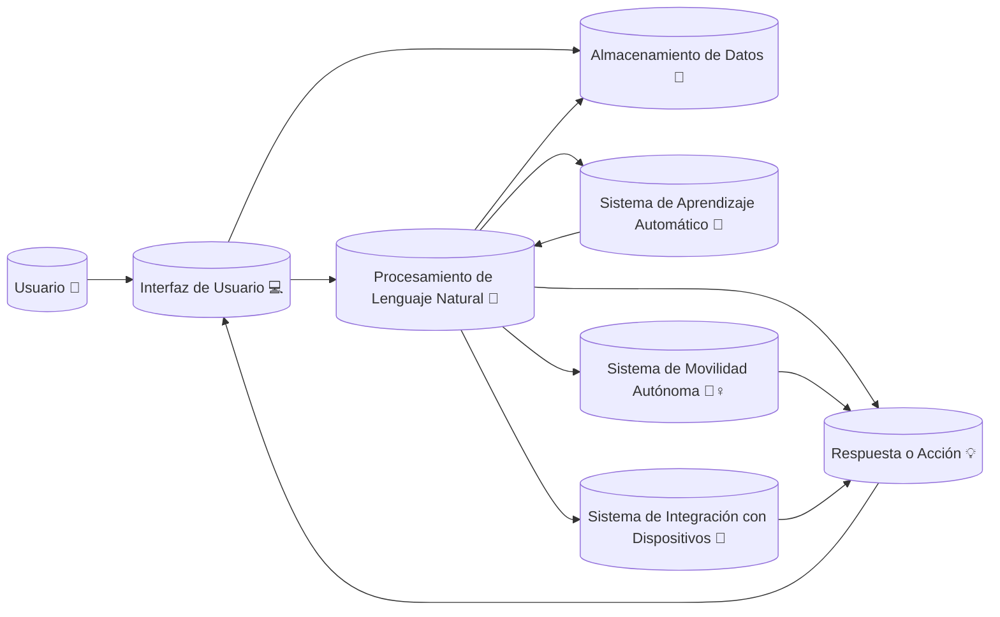

# Diagrama de Flujo de Datos🤖

 # Descripción de cada paso en el Diagrama de Flujo de Datos

1. El usuario interactúa con la interfaz de usuario del robot asistente (por ejemplo, una aplicación móvil o una interfaz web).
2. La interfaz de usuario recibe la entrada del usuario y la envía al sistema de procesamiento de lenguaje natural.
3. El sistema de procesamiento de lenguaje natural analiza la entrada del usuario, comprende el propósito y genera una respuesta o una acción adecuada.
   - Esta respuesta o acción puede ser generada utilizando datos almacenados en el sistema o a través de la interacción con el sistema de aprendizaje automático.
   - El sistema de procesamiento de lenguaje natural también puede interactuar con el sistema de movilidad autónoma o el sistema de integración con dispositivos para realizar acciones específicas.
4. La respuesta o la acción se envía de vuelta a la interfaz de usuario para ser presentada al usuario.
5. La interfaz de usuario y el sistema de procesamiento de lenguaje natural también pueden almacenar datos para análisis futuro o mejorar la capacidad de respuesta del robot.
   - Estos datos pueden incluir la entrada del usuario, la respuesta generada y cualquier información adicional relevante.
   - Los datos almacenados se pueden utilizar para entrenar el sistema de aprendizaje automático y mejorar su capacidad de comprensión y respuesta.
