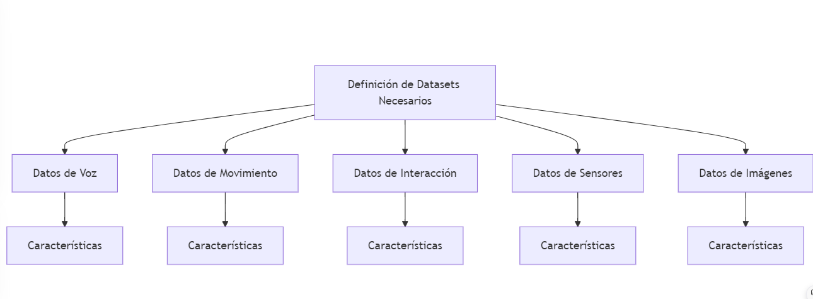

### Definición de Datasets Necesarios para Entrenar los Modelos 📊🤖

**Objetivo:**

- Definir los tipos de datasets necesarios para entrenar los modelos de Machine Learning utilizados en el robot asistente institucional.
- Especificar las características y fuentes de estos datasets.

### Tipos de Datasets Necesarios

**1. Datos de Voz: 🎤🔊**
- **Descripción:** Grabaciones de comandos de voz en diferentes idiomas y acentos.
- **Características:**
  - **Diversidad Lingüística:** 🌍 Incluir múltiples idiomas y acentos.
  - **Variedad de Comandos:** 📜 Comandos específicos para tareas del robot (por ejemplo, "abrir puerta", "llevar objeto", etc.).
  - **Calidad de Audio:** 🎧 Grabaciones de alta calidad para asegurar la precisión del reconocimiento de voz.
- **Fuentes:**
  - Grabaciones de usuarios reales en entornos controlados. 🎙️
  - Datasets públicos de reconocimiento de voz (por ejemplo, LibriSpeech, Common Voice). 🌐

**2. Datos de Movimiento: 🏃‍♂️🚶‍♀️**
- **Descripción:** Registros de trayectorias y movimientos del robot en diversos entornos.
- **Características:**
  - **Variedad de Movimientos:** 🔄 Incluir movimientos básicos y complejos (por ejemplo, avanzar, girar, evitar obstáculos).
  - **Condiciones Variadas:** 🌡️ Movimientos en diferentes condiciones de carga y temperatura.
  - **Precisión:** 🎯 Datos precisos de posición, velocidad y fuerza de los actuadores.
- **Fuentes:**
  - Simulaciones de movimientos y trayectorias. 🖥️
  - Datos históricos de movimientos del robot. 📚

**3. Datos de Interacción: 🤝👥**
- **Descripción:** Registros de interacciones con humanos, incluyendo detección y seguimiento de personas.
- **Características:**
  - **Detección de Personas:** 👀 Datos de sensores de proximidad y cámaras.
  - **Seguimiento de Personas:** 🏃 Trayectorias de movimiento de personas en el entorno.
  - **Interacciones:** 🗣️ Registros de interacciones verbales y físicas con el robot.
- **Fuentes:**
  - Grabaciones de interacciones en entornos controlados. 🎥
  - Datasets públicos de detección y seguimiento de personas (por ejemplo, KITTI, MOT). 🌟

**4. Datos de Sensores: 📡🔍**
- **Descripción:** Datos recopilados de sensores de fuerza, proximidad y seguridad.
- **Características:**
  - **Precisión:** 🎯 Datos precisos de los sensores.
  - **Variedad de Sensores:** 📈 Incluir datos de diferentes tipos de sensores (por ejemplo, LIDAR, cámaras, sensores de fuerza).
  - **Condiciones Variadas:** 🌦️ Datos en diferentes condiciones de iluminación, temperatura y ruido.
- **Fuentes:**
  - Datos históricos de sensores del robot. 📊
  - Datasets públicos de sensores (por ejemplo, KITTI, NYU Depth V2). 🌐

**5. Datos de Imágenes: 🖼️📸**
- **Descripción:** Imágenes y videos del entorno y de objetos relevantes.
- **Características:**
  - **Diversidad de Escenarios:** 🏢🏥 Incluir imágenes de diferentes entornos (oficinas, hospitales, etc.).
  - **Variedad de Objetos:** 📦 Imágenes de objetos que el robot puede interactuar (por ejemplo, puertas, objetos transportables).
  - **Calidad de Imagen:** 🏆 Imágenes de alta resolución para asegurar la precisión del reconocimiento de objetos.
- **Fuentes:**
  - Grabaciones de cámaras en entornos controlados. 🎥
  - Datasets públicos de imágenes (por ejemplo, ImageNet, COCO). 🌍

### Consideraciones Específicas para Robots Asistentes Institucionales 🏢🤖

**Interacción con humanos:**
- Detección y seguimiento de personas en el entorno. 👀
- Adaptación de velocidad y trayectoria para evitar colisiones. 🚶‍♂️
- Diseño de movimientos suaves y predecibles. 🌀

**Navegación en entornos dinámicos:**
- Manejo de obstáculos móviles. 🏃‍♂️
- Adaptación a cambios en el entorno. 🌐

**Tareas específicas:**
- Adaptación a tareas como transporte de objetos, apertura de puertas, interacción con dispositivos. 🚪📦

**Normativas de seguridad:**
- Cumplimiento de normas de seguridad para robots móviles en entornos institucionales. ⚠️

### Ampliaciones Posibles

**Aprendizaje por refuerzo:** 🤖🔄
- Mejora del rendimiento del controlador en tareas específicas.

**Control adaptativo:** ⚙️🔧
- Ajuste de parámetros en tiempo real.

**Control de fuerza:** 🛠️💪
- Realización de tareas delicadas.

### Gráficos

**Gráfico de Procesos:** 📈
 🗂️

