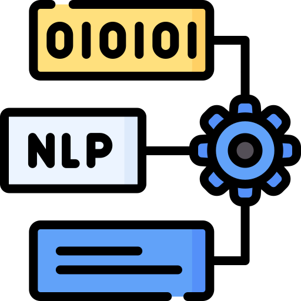
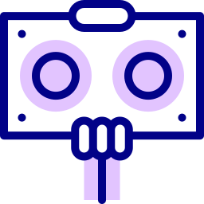
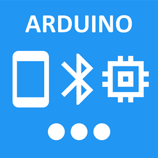

## 🚀 Capacidades de Aprendizaje Automático del Robot Asistente HORIZON

  
*Imagen representativa del robot asistente HORIZON*

El robot asistente HORIZON incorpora varias capacidades de aprendizaje automático para mejorar su rendimiento en la interacción con usuarios y en la navegación autónoma. A continuación, se describen los tipos de modelos, algoritmos y funciones de aprendizaje que se emplean en el sistema.

---

### 1. 🎙️ **Procesamiento de Lenguaje Natural (NL

HORIZON utiliza modelos de procesamiento de lenguaje natural (NLP) para interpretar comandos de voz y procesar solicitudes de información. Las principales funciones incluyen:
- **Reconocimiento de voz**: Utilizando algoritmos de **redes neuronales profundas** (DNN) para transcribir el habla en texto.
- **Análisis de intenciones**: Modelos de clasificación como **Naive Bayes** o **SVM** (Máquinas de Soporte Vectorial) para identificar la intención del usuario.
- **Procesamiento de respuestas**: Uso de un modelo **preentrenado** (como GPT o BERT) para generar respuestas contextuales.

---

### 2. 🚗 **Navegación Autónoma**

HORIZON puede desplazarse de forma autónoma, evitando obstáculos y optimizando rutas. Los sensores ultrasónicos (HC-SR04) junto con algoritmos de **aprendizaje por refuerzo** permiten que el robot aprenda a mejorar su comportamiento de navegación:
- **Algoritmos utilizados**: 
  - **Q-learning** para la optimización de trayectorias.
  - **Redes neuronales convolucionales (CNNs)** para procesar imágenes.
- **Toma de decisiones**: El robot decide la mejor acción a tomar en función de su entorno.

---

### 3. ⚙️ **Control de Movimiento y Sensores**

El control de las ruedas y la detección de obstáculos es gestionado por el Arduino Mega, que recibe señales de los sensores y ejecuta comandos de movimiento en tiempo real. Los algoritmos implementados en Python permiten el procesamiento de los datos de los sensores para ajustar la velocidad y dirección:
- **Fusión de sensores**: Uso de **filtros de Kalman** para integrar los datos de los sensores.
- **Aprendizaje supervisado**: Implementación de **regresión logística** para ajustar la sensibilidad de los sensores.

---

### 4. 🔄 **Aprendizaje Continuo**

HORIZON mejora sus capacidades de interacción y movimiento con el tiempo, empleando **aprendizaje continuo** para ajustar respuestas y trayectorias:
- **Modelos de clustering** como **K-means** para agrupar patrones de uso y optimizar la experiencia personalizada.
- **Refinamiento de modelos** mediante **actualización incremental**.

---

### 5. 📲 **Conectividad y Control Remoto**

Equipado con Bluetooth (HC-05/HC-06), HORIZON se puede controlar vía una aplicación móvil. La IA optimiza el uso de la batería y ajusta parámetros de funcionamiento en tiempo real.

---

### 6. 🛠️ **Bibliotecas y Herramientas Utilizadas**

- **Scikit-learn**: Para algoritmos de clasificación y regresión.
- **TensorFlow y Keras**: Para la creación de redes neuronales.
- **PySerial**: Comunicación entre Python y Arduino.

---

  
*Figura 1: Representación visual del robot desplazándose y evitando obstáculos*

